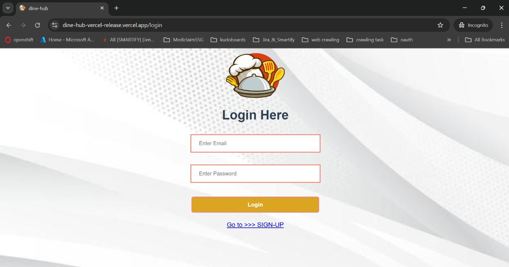

<h1 align="center">🍽️ Dine-Hub - Cafe Management Web App</h1>

<p align="center">
  <a href="https://dine-hub-web-app.vercel.app/"><strong>Live Demo</strong></a>
</p>

**Dine-Hub** is a Vue 3-based web application that simplifies cafe management. It offers secure authentication and full CRUD functionality, allowing users to add, view, update, and delete cafe records in a clean and intuitive interface.

---

## ✨ Features

### 🔐 Authentication
- **Login / Signup**: Simple and secure user authentication using JSON Server.
- **Protected Routes**: Only authenticated users can access and manage cafe data.

### 🏠 Cafe Dashboard (Post Login)
- **Add Cafe**: Easily add new cafe entries.
- **View Cafes**: Display all entries in a dynamic table format.
- **Update Cafe**: Edit existing records directly from the dashboard.
- **Delete Cafe**: Remove entries with a single click.

---

## 🛠️ Installation & Running

Clone this repository to your local machine:
```bash
    git clone https://github.com/deepanshubajaj/Dine-Hub.git
```

### 🚀 [Frontend (VUE 3)](https://github.com/deepanshubajaj/Dine-Hub/blob/main/dine-hub/README.md)

```bash
    cd dine-hub
```
```bash
    npm install
```
```bash
    npm run serve     # For local development
```
```bash
    npm run build   # For production 
```
### ⚙️ [Backend (JSON Server)](https://github.com/deepanshubajaj/Dine-Hub/blob/main/db/README.md)

```bash
    cd db
```
```bash
    npm install json-server
```
```bash
    json-server --watch db.json  # For local development
```
```bash
    json-server --watch db.json --port 3000  # For production
```

---

### 🖼️ Icon and Logo

<p align="center">
  
</p>

<p align="center">
  *This is the App Icon and Logo.*
</p>

---

### 🖼️ UI Sneak Peek

<p align="center">
  
</p>

<p align="center">
  *Screenshot of Login Page.*
</p>

<p align="center">
  
</p>

<p align="center">
  *Screenshot of Signup Page.*
</p>

<p align="center">
  
</p>

<p align="center">
  *Screenshot of Home Page.*
</p>

<p align="center">
  
</p>

<p align="center">
  *Screenshot of Add Café Page.*
</p>

<p align="center">
  
</p>

<p align="center">
  *Screenshot of Update Café Page.*
</p>

<p align="center">
  
</p>

<p align="center">
  *Screenshot of Server Running in Backend.*
</p>


---

## 📱 Live Demo

- 🌐 [Dine Hub App Live](https://dine-hub-web-app.vercel.app/)

---

## 🧠 Tech Stack

| Frontend       | Backend       | Tools/Services     |
| -------------- | ------------- | ------------------ |
| Vue 3          | JSON Server   | Vercel (Hosting)   |
| Vue Router     | REST API      | GitHub (Version Control) |
| JavaScript     |               | Render                 |

---

## 🚀 Working App Demo

### Complete App Working Video

Check out the demo of the working app below:

[Watch the Working Demo](https://github.com/user-attachments/assets/880e3a00-39b6-47ee-bdb9-710d5cf0627b)

---

## 🤝 Contributing

Thank you for your interest in contributing to this project!  
We welcome contributions, but please note:

- **Commercial use, redistribution, or modification** of the code is **not permitted** without prior written permission from the author.
- All contributions should be made with respect to the **educational and personal reference purposes** of this project.
- If you'd like to contribute, please **open an issue** or **submit a pull request**. Contributions will be reviewed by the author — **Deepanshu Bajaj**.

---

## 📃 License

This project is licensed for **Educational, Learning, and Personal Reference Use Only**.  
**Commercial use, redistribution, or modification is strictly prohibited** without prior permission.

📄 [View Full License](./LICENSE)

